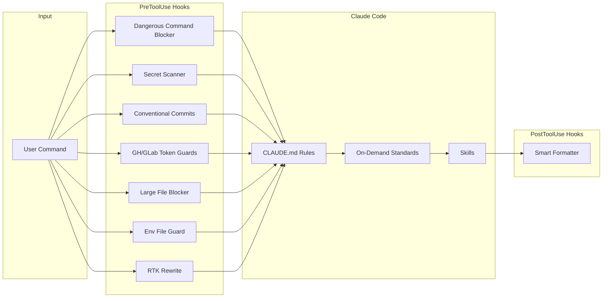

<div align="center">

<strong>Ship code that passes review the first time. 11 rules, 77 on-demand standards, 45 skills, 36 MCP servers, 32 runtime hooks, and 9 custom agents that turn Claude Code into an opinionated engineering partner.</strong>

<br>
<br>

[](https://github.com/gufranco/claude-engineering-rules/actions/workflows/ci.yml)
[](LICENSE)

</div>

---

**11** rules · **77** standards · **45** skills · **36** MCP servers · **38** hooks · **9** agents · **774** review items across **69** topics · **30,000+** lines of engineering configuration

<table>
<tr>
<td width="50%" valign="top">

### Runtime Guardrails

Thirty-two hooks intercept tool calls in real time: block destructive commands across 150+ patterns, scan for secrets from 40+ providers, enforce conventional commits, prevent large file commits, guard environment files, enforce multi-account safety for `gh`/`glab`/`docker`/`kubectl`/`aws`/`gcloud`/`terraform`/`mise`, validate git author identity, keep `settings.json` free of project- and machine-specific data, lock the assistant to English regardless of input language, ban TypeScript `any`, raw SQL, mutation methods and console.log in production code, rewrite CLI commands through RTK for 60-90% token savings, and auto-format code on every edit.

</td>
<td width="50%" valign="top">

### Two-Tier Rule Loading

11 universal rules load automatically. 77 domain-specific standards load on demand, matched by trigger keywords from `rules/index.yml`. Saves ~51KB of context per conversation by loading specialist standards only when triggered.

</td>
</tr>
<tr>
<td width="50%" valign="top">

### 41 Slash-Command Skills

`/ship`, `/review`, `/test`, `/audit`, `/plan`, `/investigate`, `/research`, and 34 more. Each skill orchestrates multi-step workflows with a single command: delivery pipelines, three-pass code review, STRIDE threat modeling, systematic debugging with 3-strike escalation, multi-source external research with cited synthesis, and architecture planning with spec folders.

</td>
<td width="50%" valign="top">

### Anti-Hallucination by Design

Mandatory verification gates: every file path, import, and API call verified before use. Pre-flight checks before implementation. Response self-check for analytical output. Prompt injection guards on skills that process external content. "Never guess" policy across all rules.

</td>
</tr>
<tr>
<td width="50%" valign="top">

### 758-Item Review Checklist

Single unified review list spanning 68 topics: correctness, security, error handling, concurrency, data integrity, testing, architecture patterns, deployment verification, LLM trust boundary, performance budgets, zero-downtime deployment, supply chain security, event-driven architecture, and licensing compliance.

</td>
<td width="50%" valign="top">

### Clean Room Verification

30+ checks across seven sections prevent plagiarism when using external projects as reference. Structural, naming, logic, license, and documentation independence gates with similarity thresholds. Mandatory closing gate on every plan.

</td>
</tr>
</table>

## The Problem

Claude Code is capable out of the box, but it does not enforce your engineering standards. It will mock your database in tests, commit with vague messages, skip CI checks, guess import paths, and write code that passes locally but fails in review. Every conversation starts from zero, with no memory of how your team works.

## The Solution

This configuration turns Claude Code into an opinionated engineering partner. Rules define what it should do. Hooks enforce it at runtime. Skills automate multi-step workflows. Standards load on demand so context stays small.

| Capability | Vanilla Claude Code | With This Config |
|:-----------|:-------------------:|:----------------:|
| Commit message enforcement | No | Conventional commits validated by hook |
| Secret scanning before commit | No | 40+ provider-specific patterns |
| Destructive command blocking | No | 150+ patterns across cloud, k8s, DB, IaC |
| Multi-account token safety | No | Inline token required for `gh` and `glab` |
| Integration-first test policy | No | Real DB, strict mock ban, AAA pattern |
| Pre-flight verification | No | Duplicate check, architecture fit, interface verification |
| On-demand domain standards | No | 77 standards, ~51KB saved per conversation |
| Workflow automation | No | 40 skills with subcommands |
| MCP server integrations | No | 36 servers: GitHub, Slack, Sentry, Linear, Figma, and more |
| Code review checklist | No | 758 items across 68 categories |
| Clean room plagiarism prevention | No | 30+ checks across 7 independence sections |

## How It Works



**Rules** define what Claude should do. **Hooks** enforce it at runtime. **Skills** automate multi-step workflows.

## What's Included

### Rules (always loaded)

11 rules in [`rules/`](rules/), loaded into every conversation automatically.

| Rule | What it covers |
|:-----|:---------------|
| [`code-style`](rules/code-style.md) | DRY/SOLID/KISS, immutability, error classification, branded types, TypeScript conventions |
| [`testing`](rules/testing.md) | Integration-first, strict mock policy, AAA pattern, fake data, deterministic tests |
| [`security`](rules/security.md) | Secrets, auth, encryption, data privacy, audit logging, supply chain security |
| [`git-workflow`](rules/git-workflow.md) | Conventional commits, branches, CI monitoring, PRs, conflict resolution |
| [`verification`](rules/verification.md) | Evidence-based completion gates, response self-check, no claim without fresh evidence |
| [`writing-precision`](rules/writing-precision.md) | Precision gate for all text: concrete over abstract, examples over vague instructions |
| [`pre-flight`](rules/pre-flight.md) | Duplicate check, market research, architecture fit, interface verification |
| [`surgical-edits`](rules/surgical-edits.md) | Every changed line traces to the request, cleanup boundaries, diff self-test |
| [`ai-guardrails`](rules/ai-guardrails.md) | AI output review, plan before generating, multi-agent validation |
| [`language`](rules/language.md) | Response language enforcement: all output in English |
| `memory-supersede` | Supersede-not-delete chain for project and feedback memories, frontmatter pointers, chain depth limit |

### Standards (loaded on demand)

75 standards in [`standards/`](standards/), loaded only when the task matches trigger keywords from [`rules/index.yml`](rules/index.yml).

Covers: API design, authentication, caching, database, distributed systems, frontend, GraphQL, gRPC, hexagonal architecture, i18n, infrastructure, message queues, microservices, monorepo, observability, privacy, resilience, serverless, state machines, Terraform testing, TypeScript 5.x, WebSocket, and 40+ more.

### Skills

42 skills in [`skills/`](skills/). Each has a `SKILL.md` with full documentation.

| Skill | Subcommands | What it does |
|:------|:------------|:-------------|
| `/ship` | `commit`, `pr`, `release`, `checks`, `worktree` | Delivery pipeline: semantic commits, PRs with CI monitoring, releases |
| `/deploy` | `land`, `canary` | Post-merge deployment, canary monitoring |
| `/review` | `code`, `qa`, `design` | Three-pass code review, QA analysis, visual/accessibility audit |
| `/audit` | `deps`, `secrets`, `docker`, `code`, `scan`, `image`, `threat`, `daily`, `comprehensive` | Security audit, STRIDE/OWASP threat modeling, supply chain |
| `/test` | `perf`, `lint`, `scan`, `ci`, `stubs` | Test execution, load testing, coverage, security scanning |
| `/plan` | `adr`, `scaffold`, `to-issues` | Structured planning with spec folders, ADRs, scaffolding, plan-to-issues export |
| `/investigate` | `--freeze` | Systematic debugging with hypothesis testing, 3-strike limit |
| `/research` | `vs`, `--quick`, `--deep`, `--resume` | Multi-source external research, entity resolution, parallel fan-out, clustered synthesis with inline citations |
| `/design` | `consult`, `variants`, `system` | Design consultation, variant exploration, design system |
| `/second-opinion` | `--mode gate/adversarial/consult` | Cross-model review via Ollama, OpenAI, or other providers |
| `/infra` | `docker`, `terraform`, `db` | Container orchestration, IaC workflows, database migrations |
| `/retro` | `discover`, `--curate`, `--promote` | Session retrospective, pattern extraction, rule graduation |
| `/assessment` | -- | Architecture completeness audit against 69-category checklist |
| `/morning` | -- | Start-of-day dashboard: open PRs, pending reviews, standup prep |
| `/incident` | -- | Incident context gathering, blameless postmortem |
| `/guard` | `<directory>`, `off` | Directory freeze + destructive command warnings + scope enforcement |
| `/benchmark` | `api`, `bundle`, `--save` | Performance regression detection with baselines |
| `/health` | -- | Code quality dashboard with weighted 0-10 score |
| `/profile` | `--db`, `--api` | N+1 queries, missing indexes, O(n^2) detection |
| `/refactor` | `--plan-only` | Guided refactoring with behavior preservation |
| `/hotfix` | -- | Emergency production fix with expedited workflow |
| `/onboard` | -- | Codebase onboarding: architecture map, "Start Here" guide |
| `/fix-issue` | `<number>` | Fix a GitHub issue by number with tests and commit |
| `/breaking-change` | `--plan-only` | API breaking change management with deprecation plan |
| `/migrate` | `<from> <to>` | Framework/library migration with incremental testing |
| `/tech-debt` | `--critical` | TODO/FIXME/HACK scanning with prioritization |
| `/cleanup` | `branches`, `prs`, `worktrees`, `--apply` | Stale branch/PR/worktree cleanup, dry-run by default |
| `/setup` | -- | Interactive project environment setup |
| `/resolve` | -- | Merge conflict resolution with verification |
| `/weekly` | `<N>`, `--sprint` | Sprint/week summary with delivery metrics |
| `/checkpoint` | `save`, `resume`, `list` | Save and resume state across sessions |
| `/readme` | -- | README generation from codebase analysis |
| `/palette` | -- | Accessible OKLCH color palette for Tailwind CSS |
| `/explain` | `--depth shallow/deep` | Code explanation with Mermaid diagrams |
| `/pr-summary` | `<number>` | PR summary with reviewer suggestions |
| `/document-release` | -- | Post-ship documentation sync |
| `/canary` | `<duration>`, `<url>` | Post-deploy HTTP monitoring |
| `/learn` | `show`, `search`, `add` | Operational learnings manager across sessions |
| `/session-log` | `export` | Session activity logger for handoff |
| `/office-hours` | `--update-docs` | Pre-code brainstorming with forcing questions, optional doc-update proposals |
| `/caveman` | `off`, `<question>` | Brevity mode toggle, under 50 words, no bullets or tables |
| `/graphify` | -- | Input to knowledge graph with clustering |

### Hooks

32 hooks in [`hooks/`](hooks/), intercepting tool calls at runtime. Every blocking hook also emits a structured JSONL event to `logs/hooks.log` so `/retro --hooks` can mine repeat offenders and propose upstream fixes in rules, skills, or `CLAUDE.md`.

| Hook | Trigger | What it does |
|:-----|:--------|:-------------|
| [`dangerous-command-blocker.py`](hooks/dangerous-command-blocker.py) | PreToolUse (Bash) | 150+ patterns: rm -rf, reverse shells, cloud CLI deletions, database drops, IaC destroy |
| [`secret-scanner.py`](hooks/secret-scanner.py) | PreToolUse (Bash) | 40+ secret patterns before git commit: AWS, Stripe, GCP, Azure, GitHub, and more |
| [`conventional-commits.sh`](hooks/conventional-commits.sh) | PreToolUse (Bash) | Validates commit messages match conventional commit format |
| [`gh-token-guard.py`](hooks/gh-token-guard.py) | PreToolUse (Bash) | Requires inline `GH_TOKEN`, blocks `gh auth switch` |
| [`glab-token-guard.py`](hooks/glab-token-guard.py) | PreToolUse (Bash) | Requires inline `GITLAB_TOKEN`, blocks `glab auth login` |
| [`docker-context-guard.py`](hooks/docker-context-guard.py) | PreToolUse (Bash) | Blocks `docker context use <name>`. Forces `--context <name>` or `DOCKER_CONTEXT=<name>` per call |
| [`kubectl-context-guard.py`](hooks/kubectl-context-guard.py) | PreToolUse (Bash) | Blocks `kubectl config use-context` and `kubectx <name>`. Forces `--context <name>` or `KUBECONFIG=<file>` per call |
| [`aws-profile-guard.py`](hooks/aws-profile-guard.py) | PreToolUse (Bash) | Blocks `aws configure set` without `--profile <name>` |
| [`gcloud-config-guard.py`](hooks/gcloud-config-guard.py) | PreToolUse (Bash) | Blocks `gcloud config set` and `gcloud config configurations activate` without `--configuration=<name>` |
| [`terraform-workspace-guard.py`](hooks/terraform-workspace-guard.py) | PreToolUse (Bash) | Blocks `terraform workspace select` and `new`. Forces `TF_WORKSPACE=<name>` per call |
| [`mise-global-guard.py`](hooks/mise-global-guard.py) | PreToolUse (Bash) | Blocks `mise use --global` and `mise unuse --global`. Forces project-local `.mise.toml` or `mise exec` |
| [`git-author-guard.py`](hooks/git-author-guard.py) | PreToolUse (Bash) | Blocks commits with no resolved identity, env-injected author overrides, local user.* writes, and pushes carrying placeholder authors |
| [`large-file-blocker.sh`](hooks/large-file-blocker.sh) | PreToolUse (Bash) | Blocks commits with files over 5MB |
| [`env-file-guard.sh`](hooks/env-file-guard.sh) | PreToolUse (Write/Edit) | Blocks `.env`, private keys, cloud credentials, Terraform state |
| [`rtk-rewrite.sh`](hooks/rtk-rewrite.sh) | PreToolUse (Bash) | Rewrites CLI commands through RTK for 60-90% token savings |
| [`ai-attribution-blocker.py`](hooks/ai-attribution-blocker.py) | PreToolUse (Bash/Write/Edit) | Blocks AI co-author trailers in commits and PRs |
| [`as-any-blocker.py`](hooks/as-any-blocker.py) | PreToolUse (Write/Edit) | Blocks TypeScript `as any`, `: any`, generic `any` |
| [`banned-phrases-blocker.py`](hooks/banned-phrases-blocker.py) | PreToolUse (Bash/Write/Edit) | Blocks ~40 conversational fluff phrases in PRs, commits, docs |
| [`banned-prose-chars.py`](hooks/banned-prose-chars.py) | PreToolUse (Write/Edit/Bash) | Blocks em dashes, parentheses in prose, emojis, ASCII art |
| [`console-log-blocker.py`](hooks/console-log-blocker.py) | PreToolUse (Write/Edit) | Blocks `console.log/warn/error` in non-test code |
| [`internal-config-leakage.py`](hooks/internal-config-leakage.py) | PreToolUse (Bash/Write/Edit) | Prevents internal config references from leaking into external output |
| [`migration-idempotency.py`](hooks/migration-idempotency.py) | PreToolUse (Write/Edit) | Forces `IF NOT EXISTS` / `IF EXISTS` on DDL in migration files |
| [`mock-internal-blocker.py`](hooks/mock-internal-blocker.py) | PreToolUse (Write/Edit) | Blocks mocking own services, DB, Redis, queues in tests |
| [`mutation-method-blocker.py`](hooks/mutation-method-blocker.py) | PreToolUse (Write/Edit/MultiEdit) | Blocks 50+ in-place mutation patterns in JS/TS across 9 categories: array prototype (9 methods), bracket-string dispatch, `Map`/`Set`/`WeakMap`/`WeakSet` mutations (6), TypedArray prototype (5), property and index assignment plus compound (`+=` ×14) and increment, `Object.assign` with non-fresh target plus `defineProperty`/`defineProperties`/`setPrototypeOf` and the four `Reflect` mutators (8), `delete` operator, `Date` setters (15 methods), global mutation, parameter reassignment, and `let`-could-be-`const`. Recognizes URLSearchParams/Headers/FormData mutation. Auto-allows Immer, Mutative, Redux Toolkit, Pinia, MobX, Zustand+produce, Valtio, Jotai, Recoil (with deprecation hint), XState v5 `assign`, Solid stores, Nanostores, LegendApp State, Tanstack Store, Effect-TS Data, Vue 3.5 readonly, Svelte 5 `$state`, Yjs CRDTs, framework navigation, and TypedArray hot paths (`crypto`, `codec`, `image`, `audio`, `parser`, `wasm`, `canvas`, `encoder`, `decoder`, `simd`, `webgl`, `pixel`, `hash`, `cipher`, `dsp`, `signal`, `fft`, `ml`, `tensor`). Emits OASIS SARIF 2.1.0 with `MUTATION_METHOD_OUTPUT=sarif`. Confidence-scored 1-10 |
| [`prisma-raw-sql-blocker.py`](hooks/prisma-raw-sql-blocker.py) | PreToolUse (Write/Edit) | Blocks Prisma raw query escape hatches outside migrations |
| [`redis-atomicity.py`](hooks/redis-atomicity.py) | PreToolUse (Write/Edit) | Forces atomic Redis sequences via Lua/MULTI |
| [`settings-hygiene.py`](hooks/settings-hygiene.py) | PreToolUse (Write/Edit/MultiEdit) | Blocks settings.json edits that introduce inline credentials, absolute home paths, or blocklisted project identifiers |
| [`english-only-reminder.sh`](hooks/english-only-reminder.sh) | UserPromptSubmit | Injects a system-reminder forcing English assistant output regardless of input language |
| [`smart-formatter.sh`](hooks/smart-formatter.sh) | PostToolUse (Edit/Write) | Auto-formats by extension: prettier, black, gofmt, rustfmt, shfmt |
| [`notify-webhook.sh`](hooks/notify-webhook.sh) | Stop | POST to `CLAUDE_NOTIFY_WEBHOOK` on response completion |
| [`retro-pointer.py`](hooks/retro-pointer.py) | Stop | One-line summary at session end when blocks accumulated, pointing to `/retro --hooks` |
| [`compact-context-saver.sh`](hooks/compact-context-saver.sh) | SessionStart/PreCompact/PostCompact | Preserves git status and branch across context compaction |

#### Hook Profile

The shared helper `hooks/_profile.py` reads two env vars to gate which hooks run:

| Env var | Values | Effect |
|---------|--------|--------|
| `CLAUDE_HOOK_PROFILE` | `minimal`, `standard` (default), `strict` | `minimal` runs only critical security hooks. `strict` enables hooks that opt in via `require_strict=True` |
| `CLAUDE_DISABLED_HOOKS` | CSV list of hook names | Each name short-circuits that hook regardless of profile |

Per-hook bypass env vars (e.g. `ALLOW_PROTECTED_BRANCH_PUSH=1`) keep working and override the profile gate.

### Custom Agents

9 specialized subagents in [`agents/`](agents/). Each follows [`TEMPLATE.md`](agents/TEMPLATE.md).

| Agent | Model | Purpose |
|:------|:------|:--------|
| [`accessibility-auditor`](agents/accessibility-auditor.md) | Sonnet | WCAG 2.1 AA accessibility review |
| [`api-reviewer`](agents/api-reviewer.md) | Sonnet | API backward compatibility and design review |
| [`blast-radius`](agents/blast-radius.md) | Haiku | Trace all consumers of changed interfaces |
| [`documentation-checker`](agents/documentation-checker.md) | Haiku | Documentation accuracy vs codebase verification |
| [`i18n-validator`](agents/i18n-validator.md) | Haiku | Translation file validation: missing keys, diacritical marks |
| [`migration-planner`](agents/migration-planner.md) | Haiku | Database migration safety, idempotency, ordering |
| [`red-team`](agents/red-team.md) | Sonnet | Adversarial analysis: attack happy paths, exploit trust assumptions |
| [`scope-drift-detector`](agents/scope-drift-detector.md) | Haiku | Compare diff against plan.md for unplanned scope |
| [`test-scenario-generator`](agents/test-scenario-generator.md) | Sonnet | Test scenarios with priority classification and traceability |

### Phase 33-40 Additions

The mutation-method-blocker v3.0.0 expansion (Phases 33 through 40) added detector coverage, editor surfaces, conformance scaffolding, type-aware analysis, and operational tooling.

| Area | What landed |
|:-----|:------------|
| Language rules | New on-demand files in [`rules/lang/`](rules/lang/): [`typescript-immutability.md`](rules/lang/typescript-immutability.md), [`typescript-types.md`](rules/lang/typescript-types.md), [`typescript-strict.md`](rules/lang/typescript-strict.md), [`prisma-migrations.md`](rules/lang/prisma-migrations.md) |
| Detector additions | WebAssembly memory writes, `Atomics.store`/`Atomics.notify`, `DataView.set*`, private-field assignment (`#field = v`), symbol-key assignment, `static {}` initializer block mutations, AsyncIterator return/throw, Stage 3 features, `URLSearchParams`/`Headers`/`FormData` mutating methods, Date setters (16 methods) |
| Reactive primitives | Svelte 5 `$state.raw` and `$derived` reassignment, Vue 3.5 `readonly()`/`shallowReadonly()` mutation, Effect-TS `Data.struct`/`Data.tagged`/`Data.tuple`, Nanostores, LegendApp State, Tanstack Store, Solid stores, Jotai/Recoil setters |
| Editor integrations | [`vscode-extension/`](vscode-extension/) (LSP-backed diagnostics), [`jetbrains-plugin/`](jetbrains-plugin/) (ExternalAnnotator + Settings), [`eslint-plugin-mutation-method-blocker/`](eslint-plugin-mutation-method-blocker/) (SARIF-bridged ESLint processor), pre-commit.com / Husky / Lefthook / Biome hook docs |
| Output formats | SARIF 2.1.0 (`MUTATION_METHOD_OUTPUT=sarif`), LSP 3.17 PublishDiagnosticsParams (`MUTATION_METHOD_OUTPUT=lsp`), default text. JSON Schemas in [`schemas/`](schemas/) |
| Conformance & deep analysis | Whole-program tracker, ts-morph bridge, codemod, allowlist schema, confidence scoring, OTEL exporter, audit log compaction, perf budget v2 |
| Source-map remapping | Findings against `dist/*`, `*.min.js`, `build/*`, and `.next/*` re-project to the original `src/*` line via sibling `.map` files. Best-effort, silent fallback to transpiled coordinates |
| Suppression budget | Per-project caps at `<root>/.claude/mutation-budget.{yml,yaml,json}`. Total + per-detector limits, optional justification trailer requirement, CI enforcement via `scripts/mutation_budget_check.py` |
| Detector tuning | Quarterly telemetry report `scripts/detector_tuning_report.py` reads audit log / OTel spans / SARIF directories, ranks detectors by allow ratio, p95 latency, and average confidence |
| Type-aware detection | `MUTATION_METHOD_TS_PROJECT_SERVICE=1` opt-in spawns a Node helper (`scripts/ts_project_service.js`) backed by the TypeScript Project Service (TS 5.6+) to resolve `ReadonlyArray`/`ReadonlyMap`/`ReadonlySet` (skip), `URLSearchParams`/`Headers`/`FormData` (keep), and `TypedArray` subtypes (hot-path semantics) |
| Docs | Migration guide [`docs/migrations/mutation-method-blocker-v1-to-v2.md`](docs/migrations/mutation-method-blocker-v1-to-v2.md), troubleshooting [`docs/guides/mutation-method-blocker-troubleshooting.md`](docs/guides/mutation-method-blocker-troubleshooting.md), add-detector and add-state-library guides, ADRs 001-005 |

### Workflow Decision Guide

| Scenario | Start with |
|:---------|:-----------|
| "I need to build X" | `/plan --discover` then implement |
| "Something is broken" | `/investigate` |
| "Can you review this PR?" | `/review 142` |
| "Is my code ready to ship?" | `/review --local` |
| "Is this project production-ready?" | `/assessment` |
| "Are we secure?" | `/audit` or `/audit comprehensive` |
| "Any vulnerable dependencies?" | `/audit deps` |
| "Time to release" | `/ship release` |
| "CI is failing" | `/ship checks` |
| "Run tests" | `/test` |
| "What did we ship this week?" | `/weekly` |
| "Prod is broken, fix NOW" | `/hotfix` |
| "Just joined this project" | `/onboard` |
| "What does the community say about X" | `/research X` |
| "X vs Y, which is better" | `/research X vs Y` |
| "This code needs restructuring" | `/refactor` |
| "Need a second opinion" | `/second-opinion --mode adversarial` |

## Quick Start

### Prerequisites

| Tool | Version | Install |
|:-----|:--------|:--------|
| Claude Code | Latest | [docs.anthropic.com](https://docs.anthropic.com/en/docs/claude-code) |
| Git | >= 2.0 | Pre-installed on macOS |
| Python 3 | >= 3.8 | Pre-installed on macOS |
| jq | >= 1.6 | `brew install jq` |
| RTK | >= 0.23.0 | `cargo install rtk` or see [rtk-ai/rtk](https://github.com/rtk-ai/rtk) |

### Setup

```bash
git clone git@github.com:gufranco/claude-engineering-rules.git
cd claude-engineering-rules
```

Symlink or copy the contents into `~/.claude/`:

```bash
# Option A: symlink (recommended, stays in sync with git)
ln -sf "$(pwd)/"* ~/.claude/

# Option B: copy
cp -r ./* ~/.claude/
```

### Verify

Open Claude Code in any project and run:

```bash
/ship commit
# Should enforce conventional commit format
```

The hooks, rules, and skills activate automatically.

### CI Integration

Several runtime hooks double as static analyzers and can run inside CI as standalone scanners. The flagship is `mutation-method-blocker.py`, which emits OASIS SARIF 2.1.0 when `MUTATION_METHOD_OUTPUT=sarif` and reads file lists from stdin or argv when `MUTATION_METHOD_BATCH_MODE=1`.

| Knob | Values | Purpose |
|------|--------|---------|
| `MUTATION_METHOD_OUTPUT` | `text` (default), `sarif`, `lsp` | Switches stdout from a Claude v2 envelope to SARIF JSON or LSP 3.17 PublishDiagnosticsParams |
| `MUTATION_METHOD_BATCH_MODE` | `0` (default), `1` | Reads paths from argv or stdin instead of a Claude payload |
| `MUTATION_METHOD_FAIL_THRESHOLD` | `error` (default), `warning`, `note`, `none` | Controls non-zero exit code in batch mode |
| `MUTATION_METHOD_TS_PROJECT_SERVICE` | `0` (default), `1` | Spawns a Node helper using the TypeScript Project Service (TS 5.6+) for type-aware readonly / URLSearchParams / TypedArray detection. Falls back silently when Node or `typescript` is missing |
| `MUTATION_METHOD_DEBUG` | `0` (default), `1` | Writes helper subprocess and source-map failures to stderr |

`.github/workflows/mutation-method-scan.yml` is the reference workflow: collect changed JS/TS files, run the hook in batch + SARIF mode, upload to GitHub code scanning. Sample snippets for GitHub Actions, GitLab CI, and CircleCI live in the code-style guidance under "Mutation Surface". The pre-commit recipe is in `.pre-commit-hooks.yaml`.

### Hook Telemetry

Every blocking hook writes a structured JSON record to the shared audit log under `logs/hooks.log`. Three companion scripts turn that stream into something a human can act on:

| Script | Role |
|--------|------|
| `scripts/audit_summarize.py` | Ad-hoc roll-up over a chosen window. Use for triaging recent activity |
| `scripts/audit_log_summary.py` | Markdown digest with top detectors, suppressions, files, and p50/p95/p99 latency. Designed for daily run + email pipe |
| `scripts/audit_log_compact.py` | Retention compaction: records older than `--retention-days` collapse into per-(hook, decision, day) summaries in `logs/hooks.summary.jsonl`, then drop from the live log |
| `scripts/mutation_budget_check.py` | Enforces the per-project `.claude/mutation-budget.{yml,yaml,json}` cap on total + per-detector `@claude-allow-mutation` markers and optional justification trailers. Exit 0 in budget, 1 over, 2 invalid config |
| `scripts/detector_tuning_report.py` | Quarterly cadence. Aggregates audit log / OTel span dump / SARIF directories and ranks detectors by allow ratio, p95 latency, and average confidence. Flags candidates with `allow_ratio > 0.5`, `p95 > 50ms`, or `avg_confidence < 3.0` |

Suggested cron entries (replace the path prefix with your install location):

```cron
0 4 * * *  python3 <install>/scripts/audit_log_compact.py --retention-days 30
0 7 * * *  python3 <install>/scripts/audit_log_summary.py --window 24h | mail -s "hook digest" $USER
```

Two opt-in env vars extend the pipeline beyond the local file:

| Env var | Format | Effect |
|---------|--------|--------|
| `MUTATION_METHOD_OTEL_EXPORTER` | `console` or `otlp+http://host:port` | Emits one OpenTelemetry span per decision via `scripts/otel_exporter.py`. Soft-fails when `opentelemetry-api` is not installed |
| `MUTATION_METHOD_PROFILE` | `1` | Wraps the hook in cProfile and writes the report to `logs/mutation_blocker_profile.txt`. Off by default |

Audit records ship a `confidence_score` field (1-10). Below 5 means a low-signal heuristic match; 5-6 a regex match against a canonical detector; 7-10 an AST-confirmed call against a typed receiver. The same scale maps to SARIF severity: `>= 5` -> `error`, `3-4` -> `warning`, `<= 2` -> `note`.

<details>
<summary><strong>Project structure</strong></summary>

```
~/.claude/
  CLAUDE.md              # Core engineering rules
  RTK.md                 # RTK token-optimized CLI proxy documentation
  settings.json          # Permissions, hooks, MCP servers, statusline
  checklists/
    checklist.md         # 774-item unified checklist across 69 categories
  rules/                 # Always loaded (10 rules)
    index.yml            # Rule + standard catalog with trigger keywords
  standards/             # Loaded on demand (75 standards)
  agents/                # Custom subagents (9 agents)
    TEMPLATE.md          # Agent template
  skills/                # 45 skills with SKILL.md each
  hooks/                 # 32 runtime hooks
  logs/                  # JSONL audit log written by blocking hooks
  scripts/               # Validation, benchmarking, statusline
  tests/
    test-hooks.sh        # Hook smoke tests (94 fixtures)
  .github/
    workflows/
      ci.yml             # Lint, validation, hook tests (ubuntu-24.04)
```

</details>

## Configuration

### MCP Servers

36 MCP servers in `settings.json`:

**Stdio (no config):** Playwright, Memory, Sequential Thinking, Docker, Lighthouse, Ollama, Filesystem

**Stdio (with env vars):** GitHub, GitLab, PostgreSQL, Redis, Slack, Obsidian, Kubernetes, AWS, Cloudflare, Puppeteer, Brave Search, Google Maps, Firecrawl, Resend, Todoist, Discord, Perplexity, LangSmith, Semgrep, Qdrant

**Remote HTTP (zero startup cost):** Sentry, Linear, Figma, Notion, Vercel, Supabase, Atlassian, Mermaid Chart, Asana

### Permissions

76 deny rules protect sensitive files: `.env` variants, `~/.ssh`, `~/.aws`, `~/.gnupg`, `*.pem`, `*.key`, `*.tfstate`, `node_modules`, and more. The `env-file-guard.sh` hook provides an additional runtime enforcement layer.

21 allow rules enable common read-only operations without prompting: `git diff`, `git log`, `git status`, `git branch`, `pnpm run`, `npm run`, `npx`.

## FAQ

<details>
<summary><strong>How do I customize or disable a rule?</strong></summary>
<br>

Rules in `rules/` are loaded into context automatically. To disable one, delete or rename the file. To customize, edit the markdown directly. Changes take effect on the next conversation.

</details>

<details>
<summary><strong>How do I add a new skill?</strong></summary>
<br>

Create a directory under `skills/` with a `SKILL.md` file. Use the frontmatter format: `name`, `description` (triggers), and the skill body with steps, output format, and rules. See any existing skill for the structure.

</details>

<details>
<summary><strong>How do I add a new agent?</strong></summary>
<br>

Copy `agents/TEMPLATE.md` and fill in each section: identity, constraints, process, output contract, scenario handling, and final checklist. Key rules: agents must not spawn subagents, must specify exact output format, and must include a verification checklist.

</details>

<details>
<summary><strong>Why integration tests over unit tests?</strong></summary>
<br>

The testing rule prioritizes integration tests with real databases and services. Unit tests are a fallback for pure functions. A test that mocks the database may pass while the actual query is broken. The mock proves the mock works, not the code. See [`rules/testing.md`](rules/testing.md).

</details>

<details>
<summary><strong>How does two-tier rule loading save context?</strong></summary>
<br>

The 75 standards total ~14,000 lines. Loading all of them into every conversation would consume ~51KB of context window. Instead, `rules/index.yml` maps each standard to trigger keywords. When a task matches (e.g., "add a database migration" triggers `database.md`), only the relevant standards load. Most conversations need 2-5 standards, saving 90%+ of the context budget.

</details>

<details>
<summary><strong>What does the dangerous command blocker cover?</strong></summary>
<br>

150+ patterns across: filesystem destruction (rm -rf, dd, mkfs), privilege escalation (sudo + destructive), reverse shells, git destructive operations (force push, filter-branch), AWS/GCP/Azure CLI deletions, platform CLI (Vercel, Netlify, Firebase), Docker/Kubernetes destructive commands, database CLI drops (Redis, MongoDB, PostgreSQL, MySQL), IaC destroy (Terraform, Pulumi, CDK), SQL statements without WHERE clauses, and credential exfiltration attempts.

</details>

## License

[MIT](LICENSE)
