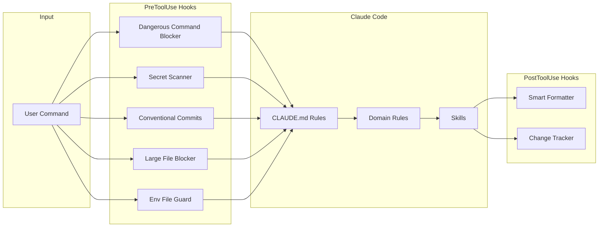

<div align="center">

<strong>Opinionated Claude Code configuration with 19 engineering rules, 21 skills, and 9 runtime hooks that enforce standards before code ships.</strong>

<br>
<br>

[](https://github.com/gufranco/claude-engineering-rules/actions/workflows/ci.yml)
[](LICENSE)

</div>

---

**19** rule files · **21** skills · **9** hooks · **322** checklist items · **32** categories · **~8,200** lines of engineering standards

<table>
<tr>
<td width="50%" valign="top">

### Runtime Guardrails

Nine hooks intercept tool calls in real time: block dangerous commands, scan for secrets, enforce conventional commits, prevent large file commits, guard environment files, auto-format code, and track every file change.

</td>
<td width="50%" valign="top">

### Domain-Specific Rules

From distributed systems and caching to frontend accessibility and database migrations. Each rule file is a standalone reference loaded into context when relevant.

</td>
</tr>
<tr>
<td width="50%" valign="top">

### Slash-Command Skills

`/commit`, `/pr`, `/review`, `/test`, `/audit`, `/incident`, and 15 more. Each skill is a structured prompt that orchestrates multi-step workflows with a single command.

</td>
<td width="50%" valign="top">

### Anti-Hallucination by Design

Mandatory verification gates, pre-flight checks, and a "never guess" policy. Every file path, import, and API call must be verified before use.

</td>
</tr>
</table>

## How It Works

This repository configures Claude Code's global behavior through `~/.claude/`. It uses three mechanisms working together:



**Rules** define what Claude should do. **Hooks** enforce it at runtime. **Skills** automate multi-step workflows.

## What's Included

### Rules

| Rule | What it covers |
|:-----|:---------------|
| `code-style` | DRY/SOLID/KISS, immutability, data safety gates, error classification, TypeScript conventions |
| `testing` | Integration-first philosophy, strict mock policy, AAA pattern, fake data generators, deterministic tests, snapshot testing guidelines |
| `resilience` | Error classification, retries with backoff, idempotency, deduplication, DLQs, circuit breakers, back pressure, bulkheads |
| `distributed-systems` | Consistency models, saga pattern, outbox, distributed locking, event ordering, schema evolution, zero-downtime deploys |
| `infrastructure` | IaC principles, networking, container orchestration, CI/CD pipeline design, cloud architecture, DORA metrics |
| `database` | Schema rules, query optimization, isolation levels, safe migrations, conditional writes, NoSQL key design |
| `api-design` | REST conventions, error format, pagination, versioning, deprecation lifecycle, rate limiting, bulk operations |
| `observability` | Structured logging, metrics naming, distributed tracing, health checks, SLIs/SLOs, alerting, incident response |
| `security` | Secrets management, auth checklist, encryption, data privacy, audit logging, supply chain security |
| `frontend` | Typography, spacing, WCAG AA contrast, responsive design, accessibility, component patterns, performance |
| `caching` | Cache-aside/write-through strategies, invalidation, thundering herd prevention, cache warming, sizing |
| `code-review` | PR authoring, review style, test evidence, branch freshness, documentation checks, tech debt tracking, ADRs |
| `git-workflow` | Conventional commits, branch naming, CI monitoring, PR creation, conflict resolution, rollback strategy |
| `debugging` | Four-phase process: reproduce, isolate, root cause, fix+verify. Multi-component tracing |
| `verification` | Evidence-based completion gates. No claim without fresh test/build/lint output |
| `pre-flight` | Duplicate check, architecture fit, interface verification, root cause confirmation, scope agreement |
| `borrow-restore` | Safe global state management for CLI tools: Docker contexts, gh accounts, terraform workspaces |
| `llm-docs` | LLM-optimized documentation URLs for 64 technologies. Fetch before coding, never guess APIs |
| `language` | Response language enforcement. All output in English regardless of user input language |

### Skills

| Skill | What it does |
|:------|:-------------|
| `/commit` | Analyze changes and create semantic conventional commits |
| `/pr` | Create or update PRs with structured descriptions |
| `/review` | Code review following the 322-item engineering checklist |
| `/assessment` | Architecture completeness audit against the full checklist |
| `/test` | Detect test runner, execute tests with coverage and linting |
| `/checks` | Monitor CI/CD checks and diagnose failures |
| `/audit` | Multi-layer security audit: dependencies, secrets, Dockerfiles, code patterns |
| `/incident` | Gather incident context and generate blameless postmortems |
| `/terraform` | Run Terraform workflows with plan review and approval gates |
| `/docker` | Manage Docker containers with Colima-aware context detection |
| `/db` | Database migrations, standalone containers, and data operations |
| `/deps` | Audit dependencies for vulnerabilities and outdated packages |
| `/release` | Tagged releases with auto-generated changelog from conventional commits |
| `/morning` | Start-of-day dashboard: open PRs, pending reviews, notifications |
| `/retro` | Analyze conversation for corrections and propose config updates |
| `/worktree` | Manage git worktrees for parallel development |
| `/scaffold` | Generate boilerplate by reading existing project patterns |
| `/readme` | Generate README by analyzing the actual codebase |
| `/design-review` | Audit pages for visual design, UX, accessibility, and contrast |
| `/palette` | Generate accessible OKLCH color palettes for Tailwind CSS |
| `/perf` | Load tests and benchmarks using k6, wrk, hey, or ab |

### Hooks

#### Global hooks (active in all projects)

| Hook | Trigger | What it does |
|:-----|:--------|:-------------|
| `dangerous-command-blocker.py` | PreToolUse (Bash) | Three-level protection: blocks catastrophic commands, protects critical paths, warns on suspicious patterns |
| `secret-scanner.py` | PreToolUse (Bash) | Scans staged files for 30+ secret patterns before any git commit |
| `conventional-commits.sh` | PreToolUse (Bash) | Validates commit messages match conventional commit format |
| `large-file-blocker.sh` | PreToolUse (Bash) | Blocks commits containing files over 5MB to prevent accidental binary commits |
| `env-file-guard.sh` | PreToolUse (Write/Edit) | Blocks modifications to `.env`, private keys, and files in secrets directories |
| `smart-formatter.sh` | PostToolUse (Edit/Write) | Auto-formats files by extension using prettier, black, gofmt, rustfmt, rubocop, or shfmt |
| `change-tracker.sh` | PostToolUse (Edit/Write) | Logs every file modification with timestamps, auto-rotates at 2000 lines |

#### Per-project hooks (opt-in)

| Hook | Trigger | What it does |
|:-----|:--------|:-------------|
| `scope-guard.sh` | Stop | Compares modified files against spec scope, warns on scope creep |
| `tdd-gate.sh` | PreToolUse (Edit/Write) | Blocks production code edits if no corresponding test file exists |

### Engineering Checklist

A 322-item checklist across 32 categories, shared by `/review` and `/assessment`. Categories include idempotency, atomicity, error classification, caching, consistency models, back pressure, saga coordination, event ordering, schema evolution, observability, security, API design, deployment readiness, graceful degradation, data modeling, capacity planning, testability, cost awareness, multi-tenancy, migration strategy, infrastructure as code, networking, container orchestration, CI/CD, and cloud architecture.

## Quick Start

### Prerequisites

| Tool | Version | Install |
|:-----|:--------|:--------|
| Claude Code | Latest | [docs.anthropic.com](https://docs.anthropic.com/en/docs/claude-code) |
| Git | >= 2.0 | Pre-installed on macOS |
| Python 3 | >= 3.8 | Pre-installed on macOS |

### Setup

```bash
git clone git@github.com:gufranco/claude-engineering-rules.git
```

Symlink or copy the contents into `~/.claude/`:

```bash
# Option A: symlink (recommended, stays in sync with git)
ln -sf "$(pwd)/claude-engineering-rules/"* ~/.claude/

# Option B: copy
cp -r claude-engineering-rules/* ~/.claude/
```

### Verify

Open Claude Code in any project and run:

```bash
/commit
# Should enforce conventional commit format
```

The hooks, rules, and skills activate automatically.

<details>
<summary><strong>Project structure</strong></summary>

```
~/.claude/
  CLAUDE.md              # Core engineering rules (~180 lines)
  settings.json          # Permissions, hooks, MCP servers, statusline
  .markdownlint.json     # Markdownlint configuration for CI
  checklists/
    engineering.md       # 322-item shared checklist (32 categories)
  rules/
    api-design.md        # REST conventions, pagination, versioning
    borrow-restore.md    # CLI context management pattern
    caching.md           # Strategies, invalidation, thundering herd
    code-review.md       # PR authoring, review style, tech debt
    code-style.md        # DRY/SOLID, immutability, TypeScript conventions
    database.md          # Schema, queries, migrations, locking
    debugging.md         # Four-phase debugging process
    distributed-systems.md # Consistency, saga, outbox, locking, events
    frontend.md          # Typography, a11y, responsive, components
    git-workflow.md      # Commits, branches, CI, PRs
    infrastructure.md    # IaC, networking, containers, CI/CD, cloud
    language.md          # Response language enforcement
    llm-docs.md          # LLM-optimized doc URLs for 64 technologies
    observability.md     # Logging, metrics, tracing, SLOs, incidents
    pre-flight.md        # Pre-implementation verification gates
    resilience.md        # Retries, idempotency, DLQs, back pressure
    security.md          # Secrets, auth, encryption, supply chain
    testing.md           # Integration-first, strict mocks, fake data, snapshots
    verification.md      # Evidence-based completion gates
  skills/
    assessment/          # Architecture completeness audit
    audit/               # Multi-layer security audit
    checks/              # CI/CD monitoring
    commit/              # Semantic commits
    db/                  # Database operations
    deps/                # Dependency auditing
    design-review/       # Visual and UX audit
    docker/              # Container management
    incident/            # Incident response and postmortems
    morning/             # Start-of-day dashboard
    palette/             # OKLCH color palette generation
    perf/                # Load testing and benchmarks
    pr/                  # Pull request creation
    readme/              # README generation
    release/             # Tagged releases
    retro/               # Session retrospective
    review/              # Code review (includes reviewer-prompt.md)
    scaffold/            # Boilerplate generation
    terraform/           # Infrastructure workflows
    test/                # Test execution
    worktree/            # Git worktree management
  hooks/
    change-tracker.sh    # File modification logging
    conventional-commits.sh  # Commit message validation
    dangerous-command-blocker.py  # Catastrophic command prevention
    env-file-guard.sh    # Environment and secret file protection
    large-file-blocker.sh # Large binary commit prevention
    scope-guard.sh       # Spec scope enforcement (per-project)
    secret-scanner.py    # Pre-commit secret scanning
    smart-formatter.sh   # Auto-formatting by extension
    tdd-gate.sh          # Test-first enforcement (per-project)
  scripts/
    context-monitor.py   # Statusline: context usage, git, duration, cost
  tests/
    test-hooks.sh        # Hook smoke tests (31 cases)
    fixtures/            # JSON fixtures for hook testing
  .github/
    workflows/
      ci.yml             # Lint (shellcheck, ruff, markdownlint) + hook tests
```

</details>

## Configuration

### MCP Servers

Two MCP servers are configured in `settings.json`:

| Server | Purpose |
|:-------|:--------|
| Context7 | Library documentation lookup via `@upstash/context7-mcp` |
| Sentry | Error tracking integration via `mcp.sentry.dev` |

### Permissions

Sensitive files are explicitly denied from read, write, and edit access:

- `.env`, `.env.local`, `.env.production`
- `secrets/**`
- `config/credentials.json`

The `env-file-guard.sh` hook provides an additional runtime layer that blocks modifications to `.env` files, private keys, and files in secrets directories, even if the deny rules are bypassed.

### Statusline

A custom Python script displays context window usage, git branch, session duration, and cost in the status bar. Context estimation uses transcript file size as a proxy for token usage, with thresholds from green to critical.

### Per-Project Hooks

Two hooks are designed for per-project activation rather than global use:

- **`scope-guard.sh`**: add to a project's `.claude/settings.json` to enforce spec file scope
- **`tdd-gate.sh`**: add to a project's `.claude/settings.json` to require test files before production code

<details>
<summary><strong>How do I add a per-project hook?</strong></summary>
<br>

Add to your project's `.claude/settings.json`:

```json
{
  "hooks": {
    "PreToolUse": [
      {
        "matcher": "Edit",
        "hooks": [
          {
            "type": "command",
            "command": "bash ~/.claude/hooks/tdd-gate.sh"
          }
        ]
      }
    ]
  }
}
```

</details>

<details>
<summary><strong>How do I customize or disable a rule?</strong></summary>
<br>

Rules in `rules/` are loaded into context automatically. To disable one, delete or rename the file. To customize, edit the markdown directly. Changes take effect on the next conversation.

</details>

<details>
<summary><strong>How do I add a new skill?</strong></summary>
<br>

Create a directory under `skills/` with a `SKILL.md` file. The file should describe when to trigger, what steps to follow, and what output to produce. See any existing skill for the format.

</details>

<details>
<summary><strong>Why integration tests over unit tests?</strong></summary>
<br>

The testing rule prioritizes integration tests with real databases and services. Unit tests are a fallback for pure functions. The reasoning: a test that mocks the database may pass while the actual query is broken. The mock proves the mock works, not the code. See `rules/testing.md` for the full philosophy.

</details>

## License

[MIT](LICENSE)
