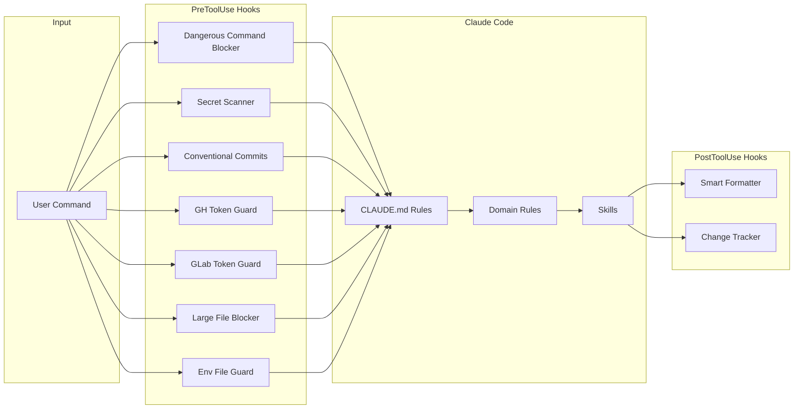

<div align="center">

<strong>Ship code that passes review the first time. 13 rules, 17 on-demand standards, 24 skills, and 11 runtime hooks for Claude Code.</strong>

<br>
<br>

[](https://github.com/gufranco/claude-engineering-rules/actions/workflows/ci.yml)
[](LICENSE)

</div>

---

**13** rules · **17** standards · **24** skills · **11** hooks · **486** checklist items · **49** categories · **~11,000** lines of engineering standards

<table>
<tr>
<td width="50%" valign="top">

### Runtime Guardrails

Eleven hooks intercept tool calls in real time: block dangerous commands, scan for secrets, enforce conventional commits, prevent large file commits, guard environment files, enforce multi-account token safety for `gh` and `glab`, auto-format code, and track every file change.

</td>
<td width="50%" valign="top">

### Two-Tier Rule Loading

Universal rules load automatically. Domain-specific standards load on demand, matched by trigger keywords from `rules/index.yml`. Cuts auto-loaded context from ~135KB to ~50KB per conversation.

</td>
</tr>
<tr>
<td width="50%" valign="top">

### Slash-Command Skills

`/commit`, `/pr`, `/review`, `/test`, `/audit`, `/incident`, and 18 more. Each skill is a structured prompt that orchestrates multi-step workflows with a single command.

</td>
<td width="50%" valign="top">

### Anti-Hallucination by Design

Mandatory verification gates, pre-flight checks, response self-check for analytical output, prompt injection guards on skills that process external content, and a "never guess" policy. Every file path, import, and API call must be verified before use.

</td>
</tr>
</table>

## The Problem

Claude Code is capable out of the box, but it does not enforce your engineering standards. It will happily mock your database in tests, commit with vague messages, skip CI checks, guess import paths, and write code that passes locally but fails in review. Every conversation starts from zero, with no memory of how your team works.

## The Solution

This configuration turns Claude Code into an opinionated engineering partner. Rules define what it should do. Hooks enforce it at runtime. Skills automate the tedious parts. Standards load on demand so context stays small.

| Capability | Vanilla Claude Code | With This Config |
|:-----------|:-------------------:|:----------------:|
| Conventional commits enforced | ❌ | ✅ |
| Secret scanning before commit | ❌ | ✅ |
| Dangerous command blocking | ❌ | ✅ |
| Multi-account token safety | ❌ | ✅ |
| Integration-first test policy | ❌ | ✅ |
| Pre-flight verification gates | ❌ | ✅ |
| On-demand domain standards | ❌ | ✅ |
| 24 workflow skills | ❌ | ✅ |
| Prompt injection guards | ❌ | ✅ |
| 486-item review checklist | ❌ | ✅ |

## How It Works

This repository configures Claude Code's global behavior through `~/.claude/`. It uses three mechanisms working together:



**Rules** define what Claude should do. **Hooks** enforce it at runtime. **Skills** automate multi-step workflows.

## What's Included

### Rules (always loaded)

These 13 rules are loaded into every conversation automatically.

| Rule | What it covers |
|:-----|:---------------|
| `code-style` | DRY/SOLID/KISS, immutability, data safety gates, error classification, discriminated unions, branded types, typed error returns, total functions, TypeScript conventions |
| `testing` | Integration-first philosophy, strict mock policy, AAA pattern, fake data generators, deterministic tests |
| `security` | Secrets management, auth checklist, encryption, data privacy, audit logging, supply chain security |
| `code-review` | PR authoring, review style, test evidence, branch freshness, documentation checks, tech debt tracking |
| `git-workflow` | Conventional commits, branch naming, local quality gate before commit/push, CI monitoring, PR creation, conflict resolution, rollback strategy |
| `debugging` | Four-phase process: reproduce, isolate, root cause, fix+verify. Multi-component tracing |
| `verification` | Evidence-based completion gates, response self-check for analytical output, no claim without fresh evidence |
| `writing-precision` | Precision gate for all text output: concrete over abstract, examples over vague instructions, self-test before finalizing |
| `pre-flight` | Duplicate check, architecture fit, interface verification, root cause confirmation, scope agreement |
| `documentation` | Preserve existing valid information when skills modify documentation files. Content migration verification for file consolidations |
| `language` | Response language enforcement. All output in English regardless of user input language |
| `github-accounts` | Multi-account safety for `gh` CLI: require inline `GH_TOKEN`, block `gh auth switch`, account mapping by remote URL |
| `gitlab-accounts` | Multi-account safety for `glab` CLI: require inline `GITLAB_TOKEN` and `GITLAB_HOST`, block `glab auth login` |

### Standards (loaded on demand)

These 17 standards live in `standards/` and are loaded only when the task matches their domain. `rules/index.yml` maps each standard to trigger keywords for automatic matching.

| Standard | What it covers |
|:---------|:---------------|
| `infrastructure` | IaC principles, networking, container orchestration, CI/CD pipeline design, cloud architecture, DORA metrics |
| `distributed-systems` | Consistency models, saga pattern, outbox, distributed locking, event ordering, schema evolution, zero-downtime deploys |
| `frontend` | Typography, spacing, WCAG AA contrast, responsive design, accessibility, component patterns, performance |
| `resilience` | Error classification, retries with backoff, idempotency, deduplication, DLQs, circuit breakers, back pressure |
| `database` | Schema rules, query optimization, isolation levels, safe migrations, conditional writes, NoSQL key design |
| `observability` | Structured logging, metrics naming, distributed tracing, health checks, SLIs/SLOs, alerting, incident response |
| `llm-docs` | LLM-optimized documentation URLs for 64 technologies. Fetch before coding, never guess APIs |
| `api-design` | REST conventions, error format, pagination, versioning, deprecation lifecycle, rate limiting, bulk operations |
| `borrow-restore` | Safe global state management for CLI tools: Docker contexts, gh accounts, terraform workspaces |
| `caching` | Cache-aside/write-through strategies, invalidation, thundering herd prevention, cache warming, sizing |
| `identifiers` | Identifier type selection: UUID v1-v8, ULID, TSID, Snowflake, TypeID, CUID2, NanoID, xid, Sqids. Decision flowchart, use-case matrix, DB storage, index performance |
| `twelve-factor` | Cloud-native app design: stateless processes, config in env, backing services, disposability, admin processes |
| `hexagonal-architecture` | Ports and adapters: port interfaces, adapter implementations, dependency direction, per-layer testing |
| `railway-oriented-programming` | Result type composition: map, flatMap, error accumulation, neverthrow, Effect, boundary conversion |
| `ddd-tactical-patterns` | Entities, value objects, aggregates, domain events, repositories, domain services, ubiquitous language |
| `state-machines` | Type state pattern, runtime state machines, transition tables, guard conditions, XState, testing strategies |
| `algorithmic-complexity` | Data structure selection guide, sorting algorithm comparison, complexity analysis rules, anti-pattern catalog, space complexity |

### Skills

| Skill | What it does |
|:------|:-------------|
| `/commit` | Analyze changes and create semantic conventional commits |
| `/pr` | Create or update PRs with structured descriptions |
| `/review` | Code review following the 486-item quality and engineering checklists |
| `/assessment` | Architecture completeness audit against the full checklist |
| `/test` | Detect test runner, execute tests with coverage and linting |
| `/checks` | Monitor CI/CD checks and diagnose failures |
| `/audit` | Multi-layer security audit: dependencies, secrets, Dockerfiles, code patterns |
| `/incident` | Gather incident context and generate blameless postmortems |
| `/terraform` | Run Terraform workflows with plan review and approval gates |
| `/docker` | Manage Docker containers with Colima-aware context detection |
| `/db` | Database migrations, standalone containers, and data operations |
| `/deps` | Audit dependencies for vulnerabilities and outdated packages |
| `/release` | Tagged releases with auto-generated changelog from conventional commits |
| `/morning` | Start-of-day dashboard: open PRs, pending reviews, notifications |
| `/retro` | Analyze conversation for corrections and propose config updates |
| `/worktree` | Manage git worktrees for parallel development |
| `/scaffold` | Generate boilerplate by reading existing project patterns |
| `/readme` | Generate README by analyzing the actual codebase |
| `/design-review` | Audit pages for visual design, UX, accessibility, and contrast |
| `/palette` | Generate accessible OKLCH color palettes for Tailwind CSS |
| `/perf` | Load tests and benchmarks using k6, wrk, hey, or ab |
| `/plan` | Structured planning with spec folder output, trade-off analysis, decisive tests, and reference gathering |
| `/discover` | Extract codebase conventions and patterns into reusable rule files |
| `/adr` | Create and manage Architecture Decision Records for significant technical decisions |

### Hooks

#### Global hooks (active in all projects)

| Hook | Trigger | What it does |
|:-----|:--------|:-------------|
| `dangerous-command-blocker.py` | PreToolUse (Bash) | Three-level protection: blocks catastrophic commands, protects critical paths, warns on suspicious patterns |
| `secret-scanner.py` | PreToolUse (Bash) | Scans staged files for 30+ secret patterns before any git commit |
| `conventional-commits.sh` | PreToolUse (Bash) | Validates commit messages match conventional commit format |
| `gh-token-guard.py` | PreToolUse (Bash) | Blocks `gh` commands without inline `GH_TOKEN` and blocks `gh auth switch` to prevent global account mutation |
| `glab-token-guard.py` | PreToolUse (Bash) | Blocks `glab` commands without inline `GITLAB_TOKEN` and blocks `glab auth login` to prevent global config mutation |
| `large-file-blocker.sh` | PreToolUse (Bash) | Blocks commits containing files over 5MB to prevent accidental binary commits |
| `env-file-guard.sh` | PreToolUse (Write/Edit/MultiEdit) | Blocks modifications to `.env`, private keys, and files in secrets directories |
| `smart-formatter.sh` | PostToolUse (Edit/Write/MultiEdit) | Auto-formats files by extension using prettier, black, gofmt, rustfmt, rubocop, or shfmt |
| `change-tracker.sh` | PostToolUse (Edit/Write/MultiEdit) | Logs every file modification with timestamps, auto-rotates at 2000 lines |

#### Per-project hooks (opt-in)

| Hook | Trigger | What it does |
|:-----|:--------|:-------------|
| `scope-guard.sh` | Stop | Compares modified files against spec scope, warns on scope creep |
| `tdd-gate.sh` | PreToolUse (Edit/Write) | Blocks production code edits if no corresponding test file exists |

### Rule Index

`rules/index.yml` is the catalog for both tiers. It maps each rule and standard to a description and trigger keywords. When a task starts, Claude matches the task against trigger keywords and reads the relevant `standards/` files on demand. Skills like `/plan` and `/discover` also reference this index. Run `/discover` to add project-specific entries.

### Checklists

Two checklists cover different layers of quality:

- **Code quality** (`checklists/code-quality.md`): 17 categories for code-level quality. Shared by completion gates (self-review loop during implementation), `/review`, and `/assessment`. Categories: correctness, security, error handling, concurrency, data integrity, algorithmic performance, frontend performance, testing, code quality and design, naming, architecture patterns, backward compatibility, dependencies, documentation, cross-file consistency, cascading fix analysis, and zero warnings.
- **Engineering** (`checklists/engineering.md`): 322 items across 32 categories for architecture, resilience, and infrastructure. Shared by `/review` and `/assessment`. Categories include idempotency, atomicity, error classification, caching, consistency models, back pressure, saga coordination, event ordering, schema evolution, observability, security, API design, deployment readiness, graceful degradation, data modeling, capacity planning, testability, cost awareness, multi-tenancy, migration strategy, infrastructure as code, networking, container orchestration, CI/CD, and cloud architecture.

## Workflows

Step-by-step guides for common engineering tasks. Each workflow references the specific skills and rules involved.

### New Feature

1. **Plan.** Run `/plan` with a description of the feature. This searches for existing solutions in the codebase, open PRs, and branches. It gathers references from similar code, matches relevant rules, evaluates alternatives, and creates a spec folder with the implementation plan.

2. **Scaffold.** If the feature involves new files, run `/scaffold <type> <name>` to generate boilerplate that matches existing project patterns. Types: endpoint, service, component, module, model, controller, middleware, hook.

3. **Implement.** Follow the spec's task breakdown. Work through each step, running `/test` after each meaningful change to catch regressions early.

4. **Test.** Run `/test --coverage` to verify coverage meets the 80% threshold for new code. Add missing tests for edge cases and error paths.

5. **Commit.** Run `/commit` to create conventional commits. Use `--push` to push immediately, or `--push --pipeline` to push and monitor CI until all checks pass.

6. **PR.** Run `/pr` to create a pull request with a structured description. Add `--pipeline` to monitor CI and auto-fix failures.

7. **Self-review.** Run `/review --local` before requesting human review to catch issues early.

### Bug Fix

1. **Reproduce.** Trigger the bug reliably. If you can't reproduce it, gather more data before proceeding.

2. **Isolate.** Find the minimal failing case. Follow the four-phase process from `rules/debugging.md`: reproduce, isolate, root cause, fix+verify.

3. **Test first.** Write a test that fails due to the bug. This proves the bug exists and prevents future regressions.

4. **Fix.** Address the root cause, not the symptom. One change at a time.

5. **Verify.** Run `/test` to confirm the new test passes and no existing tests broke. Demonstrate the fix using the original reproduction steps.

6. **Ship.** Run `/commit --push --pipeline` to commit, push, and verify CI passes.

### Debugging

Follow the four-phase process defined in `rules/debugging.md`:

1. **Reproduce.** Can you trigger it reliably? Record exact inputs, environment, and steps.

2. **Isolate.** Binary search the problem space. Comment out halves of the system until the failure disappears. Check recent changes with `git log --oneline -20`. Use `git bisect` if the bug exists on a branch but not on main.

3. **Root cause.** Explain WHY it happens, not just WHERE. Verify your theory by predicting what will happen with a specific test input, then running it. If the prediction is wrong, discard the theory and start over.

4. **Fix and verify.** Fix the cause, write a test that captures it, run the full suite. Check for the same pattern elsewhere in the codebase and fix all instances.

Use `/test` to run specific test files during isolation. Use `/checks` if the issue manifests in CI but not locally.

### Code Review

1. **Review a PR.** Run `/review <PR-number>` to review a pull request. Use `--backend` or `--frontend` to focus scope on large PRs.

2. **Review local changes.** Run `/review --local` to review your own uncommitted changes before creating a PR.

3. **Post comments.** Add `--post` to automatically post review comments to the PR after your approval.

The review skill runs three passes: per-file analysis, cross-file consistency, and cascading fix analysis. It checks against the 486-item checklist across 49 categories covering both code quality and engineering architecture.

### Architecture Planning

1. **Plan.** Run `/plan` for the feature or system change. This produces a spec folder with the implementation plan, trade-off analysis, decisive tests for each approach, and references to existing code patterns.

2. **Record decisions.** For significant decisions like database choice, service boundaries, or auth strategy, run `/adr new <title>` to create an Architecture Decision Record. ADRs capture the context, alternatives considered, and reasoning so future engineers understand WHY.

3. **Audit completeness.** After implementation, run `/assessment` to verify the implementation against architectural patterns, resilience requirements, security standards, and operational readiness.

### Establishing Project Standards

1. **Discover.** Run `/discover` in a project to extract existing conventions into rule files. The skill scans the codebase, identifies recurring patterns, and walks through each one: asking why the pattern exists, drafting a concise rule, and creating the file after your confirmation.

2. **Focus areas.** Use `/discover --area src/api` to focus on a specific module. Use `--output project` to write rules to the project's CLAUDE.md instead of global `rules/`.

3. **Iterate.** As the project evolves, run `/discover` again to capture new conventions. Run `/retro` after significant sessions to capture workflow-level patterns.

### Daily Routine

1. **Morning.** Run `/morning` for a briefing: open PRs, pending reviews, notifications, and repo state. Add `--review` to jump straight into reviewing pending PRs smallest-first.

2. **Work.** Use the feature, bug fix, or debugging workflow above. For tasks touching 3+ files, start with `/plan`.

3. **End of day.** Run `/retro` after significant sessions to capture corrections, preferences, and patterns as durable configuration updates.

### Security Audit

Run `/audit` to perform a multi-layer security scan:

- `--deps`: dependency vulnerabilities
- `--secrets`: secret detection in code and git history
- `--docker`: Dockerfile best practices
- `--code`: code-level security patterns

No arguments runs all four layers. Findings are prioritized by severity.

### Dependency Management

1. **Audit.** Run `/deps` to check for known vulnerabilities in dependencies.
2. **Outdated.** Run `/deps outdated` to list packages with available updates.
3. **Update.** Run `/deps update <package>` to update a specific dependency with full verification.
4. **Deep scan.** Run `/deps scan` to use trivy, snyk, or gitleaks for deeper analysis when available.

### Release

Run `/release` to create a tagged release with an auto-generated changelog from conventional commits. The skill detects the version bump from commit types: breaking changes bump major, features bump minor, fixes bump patch. Use `--dry-run` to preview without creating the release.

### Infrastructure

1. **Terraform.** Run `/terraform` for infrastructure changes. The skill validates before planning, plans before applying, and requires explicit approval before any apply or destroy.
2. **Docker.** Run `/docker` for container operations. The skill detects Colima profiles and uses per-command `--context` flags to avoid polluting global Docker state.
3. **Database.** Run `/db` for migrations, container management, and data operations. The skill detects your ORM and suggests your shell functions instead of raw Docker commands.

## Quick Start

### Prerequisites

| Tool | Version | Install |
|:-----|:--------|:--------|
| Claude Code | Latest | [docs.anthropic.com](https://docs.anthropic.com/en/docs/claude-code) |
| Git | >= 2.0 | Pre-installed on macOS |
| Python 3 | >= 3.8 | Pre-installed on macOS |

### Setup

```bash
git clone git@github.com:gufranco/claude-engineering-rules.git
```

Symlink or copy the contents into `~/.claude/`:

```bash
# Option A: symlink (recommended, stays in sync with git)
ln -sf "$(pwd)/claude-engineering-rules/"* ~/.claude/

# Option B: copy
cp -r claude-engineering-rules/* ~/.claude/
```

### Verify

Open Claude Code in any project and run:

```bash
/commit
# Should enforce conventional commit format
```

The hooks, rules, and skills activate automatically.

<details>
<summary><strong>Project structure</strong></summary>

```
~/.claude/
  CLAUDE.md              # Core engineering rules (~250 lines)
  settings.json          # Permissions, hooks, MCP servers, statusline
  .markdownlint.json     # Markdownlint configuration for CI
  checklists/
    code-quality.md      # 17-category code-level checklist (shared by completion gates, /review, and /assessment)
    engineering.md       # 322-item architecture/infrastructure checklist (32 categories)
  rules/                 # Tier 1: always loaded into every conversation
    index.yml            # Rule catalog with trigger keywords for both tiers
    code-review.md       # PR authoring, review style, tech debt
    code-style.md        # DRY/SOLID, immutability, FP patterns, TypeScript conventions
    debugging.md         # Four-phase debugging process
    documentation.md     # Documentation preservation during skill execution
    git-workflow.md      # Commits, branches, CI, PRs
    github-accounts.md   # GitHub multi-account safety
    gitlab-accounts.md   # GitLab multi-account safety
    language.md          # Response language enforcement
    pre-flight.md        # Pre-implementation verification gates
    security.md          # Secrets, auth, encryption, supply chain
    testing.md           # Integration-first, strict mocks, fake data, snapshots
    verification.md      # Evidence-based completion gates
    writing-precision.md # Precision gate for all text output
  standards/             # Tier 2: loaded on demand when task matches triggers
    api-design.md        # REST conventions, pagination, versioning
    borrow-restore.md    # CLI context management pattern
    caching.md           # Strategies, invalidation, thundering herd
    database.md          # Schema, queries, migrations, locking
    distributed-systems.md # Consistency, saga, outbox, locking, events
    frontend.md          # Typography, a11y, responsive, components
    identifiers.md       # Identifier type selection guide and decision framework
    infrastructure.md    # IaC, networking, containers, CI/CD, cloud
    llm-docs.md          # LLM-optimized doc URLs for 64 technologies
    observability.md     # Logging, metrics, tracing, SLOs, incidents
    resilience.md        # Retries, idempotency, DLQs, back pressure
    twelve-factor.md     # Cloud-native app design across all 12 factors
    hexagonal-architecture.md  # Ports and adapters pattern
    railway-oriented-programming.md  # Result type composition
    ddd-tactical-patterns.md   # DDD tactical patterns
    state-machines.md    # Type state and runtime state machines
    algorithmic-complexity.md  # Data structures, sorting, anti-patterns, space complexity
  skills/
    adr/                 # Architecture Decision Records
    assessment/          # Architecture completeness audit
    audit/               # Multi-layer security audit
    checks/              # CI/CD monitoring
    commit/              # Semantic commits
    db/                  # Database operations
    deps/                # Dependency auditing
    design-review/       # Visual and UX audit
    discover/            # Codebase pattern extraction
    docker/              # Container management
    incident/            # Incident response and postmortems
    morning/             # Start-of-day dashboard
    palette/             # OKLCH color palette generation
    perf/                # Load testing and benchmarks
    plan/                # Structured planning with spec folders
    pr/                  # Pull request creation
    readme/              # README generation
    release/             # Tagged releases
    retro/               # Session retrospective
    review/              # Code review (includes reviewer-prompt.md)
    scaffold/            # Boilerplate generation
    terraform/           # Infrastructure workflows
    test/                # Test execution
    worktree/            # Git worktree management
  hooks/
    change-tracker.sh    # File modification logging
    conventional-commits.sh  # Commit message validation
    dangerous-command-blocker.py  # Catastrophic command prevention
    env-file-guard.sh    # Environment and secret file protection
    gh-token-guard.py    # GitHub multi-account token enforcement
    glab-token-guard.py  # GitLab multi-account token enforcement
    large-file-blocker.sh # Large binary commit prevention
    scope-guard.sh       # Spec scope enforcement (per-project)
    secret-scanner.py    # Pre-commit secret scanning
    smart-formatter.sh   # Auto-formatting by extension
    tdd-gate.sh          # Test-first enforcement (per-project)
  scripts/
    context-monitor.py   # Statusline: context usage, git, duration, cost
  tests/
    test-hooks.sh        # Hook smoke tests (32 cases)
    fixtures/            # JSON fixtures for hook testing
  .github/
    workflows/
      ci.yml             # Lint (shellcheck, ruff, markdownlint) + hook tests
```

</details>

## Configuration

### MCP Servers

Two MCP servers are configured in `settings.json`:

| Server | Purpose |
|:-------|:--------|
| Context7 | Library documentation lookup via `@upstash/context7-mcp` |
| Sentry | Error tracking integration via `mcp.sentry.dev` |

### Permissions

Sensitive files are explicitly denied from read, write, and edit access:

- `.env`, `.env.local`, `.env.production`
- `secrets/**`
- `config/credentials.json`

The `env-file-guard.sh` hook provides an additional runtime layer that blocks modifications to `.env` files, private keys, and files in secrets directories, even if the deny rules are bypassed.

### Statusline

A custom Python script displays context window usage, git branch, session duration, and cost in the status bar. Context estimation uses transcript file size as a proxy for token usage, with thresholds from green to critical.

### Per-Project Hooks

Two hooks are designed for per-project activation rather than global use:

- **`scope-guard.sh`**: add to a project's `.claude/settings.json` to enforce spec file scope
- **`tdd-gate.sh`**: add to a project's `.claude/settings.json` to require test files before production code

<details>
<summary><strong>How do I add a per-project hook?</strong></summary>
<br>

Add to your project's `.claude/settings.json`:

```json
{
  "hooks": {
    "PreToolUse": [
      {
        "matcher": "Edit",
        "hooks": [
          {
            "type": "command",
            "command": "bash ~/.claude/hooks/tdd-gate.sh"
          }
        ]
      }
    ]
  }
}
```

</details>

<details>
<summary><strong>How do I customize or disable a rule?</strong></summary>
<br>

Rules in `rules/` are loaded into context automatically. To disable one, delete or rename the file. To customize, edit the markdown directly. Changes take effect on the next conversation.

</details>

<details>
<summary><strong>How do I add a new skill?</strong></summary>
<br>

Create a directory under `skills/` with a `SKILL.md` file. The file should describe when to trigger, what steps to follow, and what output to produce. See any existing skill for the format.

</details>

<details>
<summary><strong>Why integration tests over unit tests?</strong></summary>
<br>

The testing rule prioritizes integration tests with real databases and services. Unit tests are a fallback for pure functions. The reasoning: a test that mocks the database may pass while the actual query is broken. The mock proves the mock works, not the code. See `rules/testing.md` for the full philosophy.

</details>

## License

[MIT](LICENSE)
