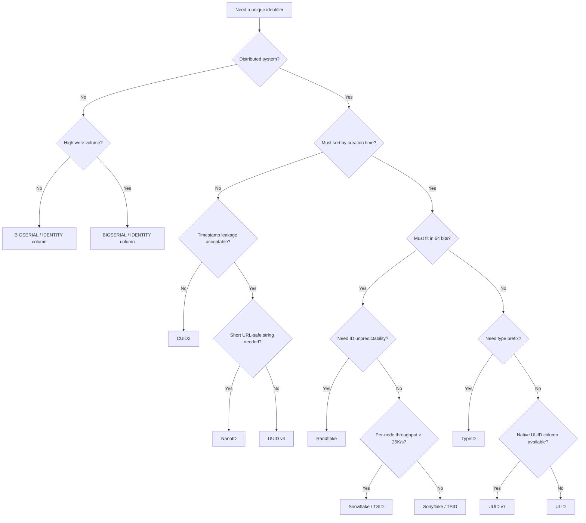

# Identifiers

## Decision Framework

Two questions determine the right identifier type:

1. **Must the ID sort chronologically?** Sortable IDs give B-tree append locality. Random IDs scatter inserts across the index.
2. **Can the ID reveal creation time?** Sortable IDs embed extractable timestamps. If creation time is sensitive, use opaque IDs.

## Quick Reference

| Identifier | Bits | String length | Sortable | Timestamp leakage | Distributed | DB type | Best for |
|:-----------|-----:|--------------:|:--------:|:-----------------:|:-----------:|:--------|:---------|
| SERIAL / BIGSERIAL | 32/64 | 1-10 / 1-20 | Yes | No | No | INT / BIGINT | Single-node databases, simple apps |
| Snowflake | 64 | 19 | Yes | Yes | Yes | BIGINT | High-throughput distributed, compact storage |
| Sonyflake | 64 | 19 | Yes | Yes | Yes | BIGINT | Many nodes (up to 65K), moderate throughput |
| TSID | 64 | 13 | Yes | Yes | Yes | BIGINT | Drop-in BIGINT PK replacement, compact string |
| Randflake | 64 | 13 | No | No | Yes | BIGINT | Unpredictable IDs that fit in BIGINT |
| xid | 96 | 20 | Yes | Yes | Yes | VARCHAR(20) | Compact sortable IDs, zero config |
| ObjectId | 96 | 24 | Roughly | Yes | Yes | VARCHAR(24) | MongoDB only |
| UUID v4 | 128 | 36 | No | No | Yes | UUID | Opaque tokens, session IDs, correlation IDs |
| UUID v7 | 128 | 36 | Yes | Yes | Yes | UUID | Database PKs, event sourcing, audit logs |
| ULID | 128 | 26 | Yes | Yes | Yes | CHAR(26) / UUID | Readable sortable IDs, no native UUID column |
| TypeID | 128 + prefix | 28-90 | Yes | Yes | Yes | VARCHAR | Type-safe API IDs (Stripe-style) |
| CUID2 | ~124 | 24 | No | No | Yes | VARCHAR(24) | Public-facing IDs where privacy matters |
| NanoID | ~126 | 21 | No | No | Yes | VARCHAR(21) | Short, URL-safe random tokens |
| Sqids | Variable | Variable | No | No | N/A | VARCHAR | Encoding existing integers for public URLs |

## Detailed Profiles

### Auto-Increment (SERIAL / BIGSERIAL / AUTO_INCREMENT)

Sequential integers assigned by the database.

| Property | Value |
|:---------|:------|
| Size | 4 bytes (INT) or 8 bytes (BIGINT) |
| Sortable | Yes (sequential) |
| Distributed | No. Sequences are local to one database instance |
| Privacy | Sequential, enumerable. Leaks record count and creation order |

**PostgreSQL:** use `GENERATED ALWAYS AS IDENTITY` over `SERIAL`. IDENTITY is SQL-standard, prevents accidental manual inserts, and ties the sequence as a proper internal dependency.

**MySQL:** `AUTO_INCREMENT` with `innodb_autoinc_lock_mode = 2` (default in MySQL 8.x). Multi-primary setups use `auto_increment_increment` and `auto_increment_offset` but this caps at ~9 nodes.

**Rules:**
- Always use BIGINT/BIGSERIAL from the start. Migrating from INT to BIGINT on a large table requires downtime.
- Never expose auto-increment IDs in public APIs without authorization checks. IDOR risk.
- Not suitable for sharded or multi-region databases.

### UUID v1: Time + MAC Address (DEPRECATED)

**Do not use for new systems.** RFC 9562 explicitly recommends v7 over v1.

- Timestamp bits are scattered across the layout, making it not lexicographically sortable despite containing a timestamp.
- Embeds the machine's MAC address, exposing hardware identity.
- Only valid use: backward compatibility with systems already using v1.

### UUID v2: DCE Security (DEPRECATED)

**Do not use.** Historical artifact for DCE/RPC environments. Most UUID libraries do not implement it. RFC 9562 excludes it from scope.

### UUID v3: Name-based, MD5 (DEPRECATED)

**Do not use.** Same purpose as v5 but uses the cryptographically broken MD5 hash. RFC 9562 states: "UUIDv5 SHOULD be used in lieu of UUIDv3."

### UUID v4: Random

122 bits of cryptographically secure randomness. No structure, no timestamp, no machine identity.

| Property | Value |
|:---------|:------|
| Size | 128 bits, 36-character string |
| Sortable | No. Random distribution |
| Distributed | Yes. No coordination needed |
| Privacy | Leaks nothing |
| Collision at 50% | ~2.71 quintillion IDs |
| DB type | Native `UUID` column |

**Use when:** ID ordering does not matter and privacy is a priority. Session tokens, CSRF tokens, correlation IDs, any opaque reference.

**Avoid when:** Using as a database PK in write-heavy workloads. Random distribution causes poor B-tree index locality: inserts scatter across the index, increasing page splits and I/O.

### UUID v5: Name-based, SHA-1

Deterministic: same namespace + same name always produces the same UUID. Uses SHA-1.

**Use when:** generating stable, reproducible IDs from known inputs. Content-addressable identifiers, API resource IDs derived from natural keys.

**Avoid when:** organizational policy prohibits SHA-1. Use v8 with SHA-256 instead.

### UUID v6: Reordered Gregorian Time (TRANSITIONAL)

Reorders v1's scattered timestamp bits for lexicographic sortability. Still uses the Gregorian epoch and can embed MAC addresses.

**Use only when:** migrating existing v1 systems to sortable UUIDs. RFC 9562 states: "Systems that do not involve legacy UUIDv1 SHOULD use UUIDv7 instead."

### UUID v7: Unix Epoch Time (RECOMMENDED DEFAULT)

48-bit millisecond Unix timestamp in the most significant bits, followed by ~74 bits of random or counter data. RFC 9562's recommended default for new time-based UUID needs.

| Property | Value |
|:---------|:------|
| Size | 128 bits, 36-character string |
| Sortable | Yes. Binary and string comparison yield chronological order |
| Distributed | Yes. No coordination needed |
| Privacy | Millisecond timestamp is extractable. No machine identity |
| Monotonicity | Three strategies: fixed counter, monotonic random increment, sub-ms precision |
| DB type | Native `UUID` column |
| Timestamp range | Until year 10889 AD |

**Use when:** database PKs, event sourcing, audit logs, any write-heavy workload needing time ordering. The default choice when both sortability and UUID compatibility matter.

**Avoid when:** creation timestamp must not be derivable from the ID. Use v4 instead.

### UUID v8: Custom/Experimental

Only version and variant bits are mandated. The remaining 122 bits are application-defined.

**Use when:** embedding custom data like SHA-256 hashes, composite identifiers, or application-specific timestamps. Not a replacement for v4.

### ULID

128 bits: 48-bit millisecond timestamp + 80 bits of cryptographic randomness. Encoded as a 26-character Crockford's Base32 string.

| Property | Value |
|:---------|:------|
| Size | 128 bits, 26-character string |
| Sortable | Yes. Crockford's Base32 preserves sort order |
| Distributed | Yes. No coordination needed |
| Privacy | Timestamp is extractable at millisecond precision |
| Monotonicity | Random component increments by 1 within the same millisecond. Overflow throws an error |
| Randomness | 80 bits per millisecond |
| Standardization | Community spec, no IETF RFC |

**ULID vs UUID v7:**

| Criterion | UUID v7 | ULID |
|:----------|:--------|:-----|
| Standard | IETF RFC 9562 | Community spec |
| String length | 36 chars | 26 chars |
| Encoding | Hex with hyphens | Crockford's Base32 |
| Human readability | Lower | Higher (no ambiguous chars) |
| Random bits | ~74 | 80 |
| Native DB UUID type | Yes | Needs VARCHAR or conversion |
| Ecosystem | All UUID libraries | Separate, smaller ecosystem |

**Choose UUID v7** when the system already uses UUIDs, has UUID-typed columns, or interoperability matters. **Choose ULID** when the 26-character compact form and human readability provide concrete benefits, or when native UUID column types are unavailable.

### TypeID

UUIDv7 encoded as Crockford's Base32 with a type prefix: `user_2x4y6z...`, `order_7k8m9n...`.

| Property | Value |
|:---------|:------|
| Size | 128 bits + prefix, 28-90 character string |
| Sortable | Yes (within the same prefix). Inherits UUIDv7 ordering |
| Distributed | Yes |
| Privacy | Timestamp extractable. Entity type visible by design |
| Standardization | Jetify spec v0.3.0 |

**Use when:** building APIs where type safety at the ID level matters. Developers and log readers can identify entity types at a glance. Prevents cross-entity ID confusion at the type level.

**Avoid when:** exposing entity types in IDs is undesirable, or maximum compactness is required.

### Snowflake

64-bit integer: 41-bit millisecond timestamp + 10-bit machine ID (5 datacenter + 5 worker) + 12-bit sequence counter.

| Property | Value |
|:---------|:------|
| Size | 8 bytes, up to 19 decimal digits |
| Sortable | Yes. Time-ordered, roughly monotonic across workers |
| Distributed | Yes. Requires machine ID coordination |
| Privacy | Timestamp, datacenter ID, and worker ID are all extractable |
| Capacity | 4,096 IDs/ms per worker, 1,024 workers |
| Configuration | Requires unique worker ID assignment (originally via ZooKeeper) |
| Lifetime | ~69 years from custom epoch |

**Use when:** high-throughput distributed systems need compact, sortable 64-bit IDs and infrastructure exists to assign worker IDs.

**Avoid when:** you cannot coordinate worker IDs, or ID unpredictability is required.

### Sonyflake

64-bit integer: 39-bit timestamp (10ms resolution) + 8-bit sequence + 16-bit machine ID.

| Property | Value |
|:---------|:------|
| Size | 8 bytes |
| Sortable | Yes |
| Distributed | Yes. Supports up to 65,536 machines (vs Snowflake's 1,024) |
| Privacy | Timestamp and machine ID extractable |
| Capacity | 256 IDs per 10ms per instance (25,600/s) |
| Configuration | Machine ID defaults to lower 16 bits of private IP. Customizable |
| Lifetime | ~174 years from start time |

**Use when:** many generator nodes (> 1,024) but moderate per-node throughput is acceptable. Default machine ID derivation from IP simplifies configuration.

**Avoid when:** a single instance needs more than 25,600 IDs/second.

### TSID (Time-Sorted ID)

64-bit integer: 42-bit millisecond timestamp + configurable split between node ID and counter bits (total 22 bits).

| Property | Value |
|:---------|:------|
| Size | 8 bytes, 13-character Crockford's Base32 string |
| Sortable | Yes. Both numeric and string comparison work |
| Distributed | Yes. Requires node ID assignment |
| Privacy | Timestamp and node ID extractable |
| Capacity | Configurable. Default: 4,096 IDs/ms per node, 1,024 nodes |
| Lifetime | ~69 years from 2020-01-01 epoch (unsigned: ~139 years) |

**Use when:** you need a compact sortable ID that fits in a BIGINT column. The 13-character string form is the most compact among all sortable options. Drop-in replacement for auto-increment PKs in systems that need distribution.

**Avoid when:** IDs must be unpredictable, or you lack node ID coordination.

### Randflake

64-bit integer encrypted with Sparx64 block cipher. Pre-encryption: 30-bit timestamp (seconds) + 17-bit node ID + 17-bit counter.

| Property | Value |
|:---------|:------|
| Size | 8 bytes |
| Sortable | No. Encryption destroys ordering |
| Distributed | Yes. Requires lease-based node ID coordination |
| Privacy | Timestamp and node recoverable only with the secret key |
| Capacity | 131,072 IDs/s per node, 131,072 nodes |
| Configuration | Requires secret key management + lease coordination service |
| Lifetime | ~34 years from epoch |

**Use when:** IDs must fit in BIGINT, be unpredictable externally, but traceable internally with the encryption key. Good sharding key due to uniform distribution.

**Avoid when:** you lack secure key management infrastructure, or need sortable IDs.

### xid

96 bits: 32-bit Unix timestamp (seconds) + 24-bit machine ID + 16-bit process ID + 24-bit counter.

| Property | Value |
|:---------|:------|
| Size | 12 bytes, 20-character base32hex string |
| Sortable | Yes. Second-level resolution |
| Distributed | Yes. Zero configuration |
| Privacy | Timestamp, machine ID, and process ID extractable |
| Capacity | 16,777,216 IDs/s per process |
| Configuration | None. Machine ID derived from hostname automatically |

**Use when:** you need compact, sortable, zero-config IDs and can accept second-level timestamp resolution. 20 characters is shorter than UUID (36) or ULID (26).

**Avoid when:** millisecond-level ordering matters, or IDs must fit in a 64-bit integer.

### CUID2

~124 bits hashed through SHA-3. Inputs: timestamp, CSPRNG random, session counter, host fingerprint. Always starts with a letter.

| Property | Value |
|:---------|:------|
| Size | 24 characters (default, configurable up to 32) |
| Sortable | No. By design |
| Distributed | Yes. No coordination |
| Privacy | SHA-3 hides all entropy sources. Nothing extractable |
| Collision at 50% | ~4.0 x 10^18 IDs (24 chars) |

**Use when:** public-facing IDs where privacy matters and ordering is not needed. The SHA-3 hash makes it impossible to extract timestamps, counters, or host information from the ID.

**Avoid when:** chronological sorting by ID is required. The intentional hashing adds overhead compared to pure random generators.

### NanoID

Pure cryptographically secure random bytes mapped to a configurable alphabet. Default: 21 characters, URL-safe alphabet (A-Za-z0-9_-), ~126 bits of entropy.

| Property | Value |
|:---------|:------|
| Size | 21 characters default (configurable) |
| Sortable | No. Pure random |
| Distributed | Yes. No coordination |
| Privacy | Leaks nothing. No structure |
| Library size | 118 bytes minified + brotli |
| Performance | ~3.7M ops/sec (Node.js) |

**Use when:** you need short, URL-safe random IDs and UUID v4's 36-character format is too long. Comparable collision resistance to UUID v4 in fewer characters.

**Avoid when:** ordering matters, or you need to extract metadata from the ID. Never use the `nanoid/non-secure` variant in production.

### MongoDB ObjectId

96 bits: 32-bit Unix timestamp + 40-bit random (per-process) + 24-bit counter.

**Use only with MongoDB.** Outside MongoDB, prefer xid (same concept, more compact encoding) or UUID v7 (standardized).

### Firebase Push ID

120 bits: 48-bit millisecond timestamp + 72-bit random (incremented within same millisecond).

**Use only with Firebase Realtime Database.** The format is tightly coupled to Firebase's ordering semantics. Outside Firebase, use UUID v7 or ULID.

### Sqids (formerly Hashids)

**Not an ID generator.** An encoding scheme that converts integers to short, URL-safe strings. Reversible: strings decode back to the original numbers.

| Property | Value |
|:---------|:------|
| Purpose | Encode auto-increment PKs for public URLs |
| Reversible | Yes. Not encryption, not security |
| Deterministic | Yes. Same input always produces same output |
| Profanity filter | Built-in, customizable blocklist |

**Use when:** you need to hide auto-increment PKs in URLs without changing the underlying ID strategy. YouTube-style short IDs from database integers.

**Never use as:** a security mechanism, an access control layer, or a substitute for proper authorization checks. Anyone can reverse the encoding.

## Decision by Use Case

| Use case | Recommended | Why |
|:---------|:------------|:----|
| Database PK (single node) | BIGINT IDENTITY | Simplest, best performance, sequential |
| Database PK (distributed, UUID columns) | UUID v7 | Sortable, standard, native DB support |
| Database PK (distributed, BIGINT columns) | TSID | Sortable, compact, fits in BIGINT |
| Database PK (distributed, no column constraints) | UUID v7 or ULID | ULID if readability matters |
| API resource ID (type-safe) | TypeID | Entity type visible in the ID |
| API resource ID (opaque) | CUID2 or NanoID | No information leakage |
| Public URL slug | Sqids over auto-increment | Hides sequential PKs |
| Session / CSRF token | UUID v4 | No structure, no timestamp, standard |
| Correlation / trace ID | UUID v4 | Opaque, standard, works across services |
| Event sourcing / audit log | UUID v7 | Time-ordered, standard, extractable timestamp |
| High-throughput distributed (compact) | Snowflake or TSID | 64-bit, sortable, millions of IDs/sec |
| Many nodes, moderate throughput | Sonyflake | 65K nodes, simple IP-based machine ID |
| Unpredictable + compact | Randflake | BIGINT-sized, encrypted, internally traceable |

## Database Storage

| ID type | PostgreSQL | MySQL | DynamoDB |
|:--------|:-----------|:------|:---------|
| Auto-increment | `BIGINT GENERATED ALWAYS AS IDENTITY` | `BIGINT UNSIGNED AUTO_INCREMENT` | N/A |
| UUID v4 / v7 | `UUID` (16 bytes, native) | `BINARY(16)` with `BIN_TO_UUID()` | `S` (string) |
| ULID | `UUID` (with conversion) or `CHAR(26)` | `BINARY(16)` or `CHAR(26)` | `S` (string) |
| TypeID | `VARCHAR(90)` | `VARCHAR(90)` | `S` (string) |
| TSID / Snowflake | `BIGINT` | `BIGINT UNSIGNED` | `N` (number) |
| CUID2 | `VARCHAR(24)` | `VARCHAR(24)` | `S` (string) |
| NanoID | `VARCHAR(21)` | `VARCHAR(21)` | `S` (string) |
| xid | `CHAR(20)` | `CHAR(20)` | `S` (string) |

**PostgreSQL `UUID` type:** 16 bytes, indexed as a fixed-size binary value. More efficient than `VARCHAR(36)` for UUIDs. Use `gen_random_uuid()` for v4. For v7, generate in the application layer.

**MySQL `BINARY(16)`:** store UUIDs as raw bytes for compact storage and faster indexing. Use `UUID_TO_BIN(uuid, 1)` for swap-flag ordering (makes v1/v4 UUIDs index-friendly). For v7, the swap flag is unnecessary since the timestamp is already in the most significant bits.

## Index Performance

Random IDs (v4, NanoID, CUID2) cause write amplification in B-tree indexes:

- New rows insert at random positions, splitting existing pages.
- Working set for the index grows because recently-written pages are scattered across the tree.
- Buffer pool efficiency drops: hot pages are not contiguous.

Sortable IDs (v7, ULID, TSID, Snowflake) concentrate writes at the right edge of the B-tree:

- New rows always append to the rightmost leaf page.
- Only the rightmost pages need to be in memory for writes.
- Sequential I/O patterns for both writes and range scans.

**Measured impact:** on write-heavy workloads with large tables (> 10M rows), sortable IDs show 2-5x better insert throughput compared to random UUIDs. The gap widens as the table grows and the index no longer fits in memory.

## Migration Path

When migrating from one ID type to another:

1. Add the new ID column alongside the existing one. Populate it for new rows.
2. Backfill existing rows in batches.
3. Build an index on the new column.
4. Update application code to use the new ID. Keep reading the old ID for backward compatibility.
5. After all clients migrate, drop the old column.

Never change a primary key in-place on a live table.

## Anti-Patterns

- **INT for a table that will exceed 2 billion rows.** Use BIGINT from the start. The migration is painful.
- **UUID v4 as PK on a write-heavy table.** Random distribution kills B-tree performance. Use v7.
- **Exposing auto-increment IDs in APIs.** Enables enumeration attacks and leaks record counts. Use opaque IDs for public interfaces.
- **UUID v1 in new systems.** Leaks MAC address, not sortable. Use v7.
- **Treating Sqids as encryption.** It is reversible encoding, not security.
- **NanoID with `non-secure` mode in production.** Uses `Math.random()`, which is not cryptographically secure.
- **SERIAL instead of BIGSERIAL in PostgreSQL.** INT overflow on growing tables requires downtime to fix.
- **Storing UUIDs as `VARCHAR(36)` when a native `UUID` type exists.** Wastes storage (36 bytes vs 16 bytes) and reduces index performance.

## Related Standards

- `standards/database.md`: Database
- `standards/distributed-systems.md`: Distributed Systems
