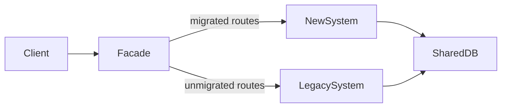

# Strangler Fig Migration

## When to Use

The strangler fig pattern applies when a large legacy system must be replaced incrementally. A full rewrite is too risky, too slow, or both. Instead, a facade intercepts requests and routes them to either the legacy system or the new system based on migration status.

| Situation | Strangler fig fit |
|-----------|------------------|
| Large monolith with years of accumulated logic | Yes, primary use case |
| Small application that can be rewritten in weeks | No, direct rewrite is faster |
| System with no clear module boundaries | Yes, but requires upfront analysis to identify seams |
| Legacy system that must remain operational during migration | Yes, zero-downtime transition |
| System with poor or no test coverage | Yes, but add characterization tests before migrating |
| Multiple teams need to migrate different areas concurrently | Yes, each team migrates their domain independently |

## Architecture



The facade is a reverse proxy or API gateway that inspects each request and routes it based on a migration configuration. As more routes are migrated, traffic shifts from the legacy system to the new system until the legacy system handles zero traffic and can be decommissioned.

## Facade Layer

The facade is the single entry point for all client traffic. It must be thin and stateless.

| Facade responsibility | Not a facade responsibility |
|----------------------|---------------------------|
| Request routing based on migration status | Business logic |
| Protocol translation if needed | Data transformation |
| Health checking both systems | Caching |
| Logging routing decisions | Authentication decisions |

```typescript
async function routeRequest(req: IncomingRequest): Promise<Response> {
  const migrationStatus = await migrationConfig.getStatus(req.path);

  switch (migrationStatus) {
    case "legacy":
      return forwardToLegacy(req);
    case "new":
      return forwardToNew(req);
    case "shadow":
      return shadowTest(req);
    default:
      return forwardToLegacy(req);
  }
}
```

## Request Routing by Migration Status

Each route has a migration status that controls where traffic goes.

| Status | Behavior | Purpose |
|--------|----------|---------|
| `legacy` | 100% to legacy system | Default state, not yet migrated |
| `shadow` | Legacy serves the response, new system receives a copy | Validate new system behavior without user impact |
| `canary` | Small percentage to new system, rest to legacy | Test new system under real load |
| `new` | 100% to new system | Migration complete for this route |
| `rollback` | Was `new`, reverted to `legacy` | Incident response |

Store migration status in a fast lookup: Redis, feature flag service, or in-memory config with hot reload. Route decisions must add minimal latency.

## Data Consistency During Transition

The hardest part of strangler fig migration is keeping data consistent while two systems read and write the same domain.

### Strategy 1: Shared database

Both systems use the same database. The new system adopts the legacy schema initially, then migrates the schema incrementally using expand-contract.

- Simplest approach. No data sync needed.
- Risk: schema changes must be backward-compatible with the legacy system until the route is fully migrated.
- Works well when the new system is a rewrite of the application layer, not the data layer.

### Strategy 2: Dual writes

The system that handles the request writes to both the legacy and new data stores.

- Higher complexity. Both writes must succeed or the systems diverge.
- Use a transactional outbox or change data capture to keep stores in sync.
- Acceptable as a temporary measure during migration. Not a long-term architecture.

### Strategy 3: Parallel running with reconciliation

Both systems process the same request. Compare outputs. Alert on divergence.

```typescript
async function shadowTest(req: IncomingRequest): Promise<Response> {
  const [legacyResponse, newResponse] = await Promise.allSettled([
    forwardToLegacy(req),
    forwardToNew(req),
  ]);

  // Always return the legacy response to the user
  const response = legacyResponse.status === "fulfilled"
    ? legacyResponse.value
    : fallbackError();

  // Compare asynchronously, do not block the response
  compareResponses(legacyResponse, newResponse, req).catch(logComparisonError);

  return response;
}
```

- Shadow testing validates behavior without user impact.
- Compare response bodies, status codes, and headers.
- Ignore expected differences: timestamps, generated IDs, formatting.
- Track match rate as a metric. Target 100% match before switching traffic.

## Migration Progress Tracking

Maintain a migration registry that tracks the status of every route.

| Route pattern | Status | Owner | Migrated date | Notes |
|--------------|--------|-------|---------------|-------|
| `GET /api/users` | new | Team Alpha | 2025-11-15 | Migrated with schema V2 |
| `POST /api/users` | canary | Team Alpha | - | 5% traffic, monitoring |
| `GET /api/orders` | shadow | Team Beta | - | 98% match rate |
| `POST /api/orders` | legacy | Team Beta | - | Blocked on payment integration |

- Review migration progress weekly.
- Set milestones: 25%, 50%, 75%, 100% of routes migrated.
- Track velocity: routes migrated per sprint.
- Identify blockers early. Routes that remain in `legacy` status for more than two sprints need escalation.

## Rollback Strategy

Every migrated route must have a tested rollback path.

| Rollback scope | Mechanism | Recovery time |
|---------------|-----------|--------------|
| Single route | Change migration status from `new` to `legacy` | Seconds, config change |
| Multiple routes | Revert migration config to a previous version | Minutes |
| Full system | Route all traffic to legacy | Minutes, if legacy is still running |

- Keep the legacy system running and deployable until all routes are migrated and stable for at least 30 days.
- Test rollback before each migration. Simulate a failure in the new system and verify traffic returns to the legacy system.
- After rollback, investigate the failure before re-migrating.

## Migration Sequence

Not all routes are equal. Migrate in order of risk and value.

1. Read-only, low-traffic routes first. Lowest risk. Validates the facade, routing, and new system integration.
2. Read-only, high-traffic routes. Validates performance under load.
3. Write routes with simple logic. First write operations. Validates data consistency.
4. Write routes with complex business logic. Highest risk. Requires thorough shadow testing.
5. Admin and internal routes last. Lower user impact if issues arise.

## Characterization Tests

Before migrating a route, capture the legacy system's exact behavior with characterization tests. These tests document what the system actually does, not what it should do.

- Record request/response pairs from production traffic.
- Replay them against the new system.
- Any difference is either a bug in the new system or an intentional behavior change.
- Intentional changes must be documented and approved before migration.

## Decommissioning the Legacy System

After all routes are migrated and stable:

1. Monitor for any residual traffic to the legacy system. If zero for 30 days, proceed.
2. Remove the legacy routes from the facade.
3. Archive the legacy codebase.
4. Remove legacy infrastructure.
5. Clean up any dual-write or sync mechanisms.
6. Update documentation to reflect the new system as the sole system.

Do not rush decommissioning. A premature shutdown when an undiscovered route still depends on the legacy system causes an outage.

## Related Standards

- `standards/zero-downtime-deployments.md`: Zero-Downtime Deployments
- `standards/database.md`: Database
